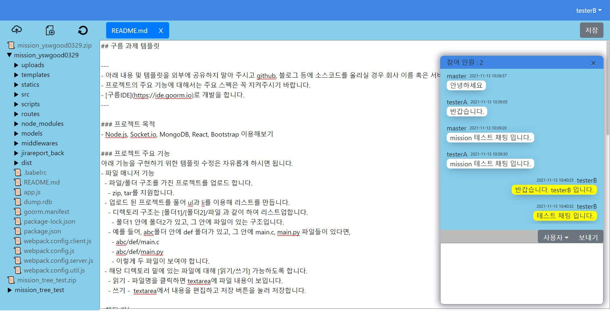
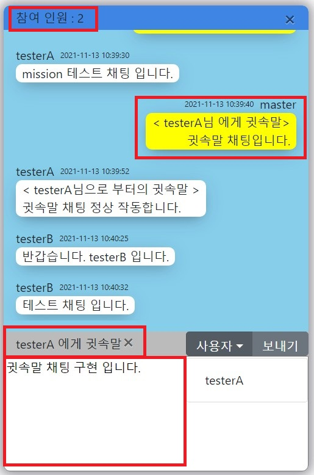
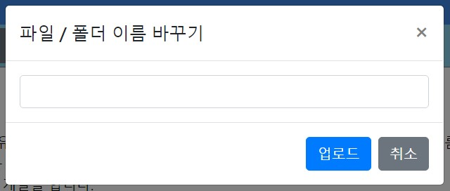

# 구름 과제 템플릿 설명

---
- 구름 풀스택 개발 직무 지원자 양승우 미션 수행 결과 설명 파일 입니다.
- https://github.com/BallboyDev/test/blob/main/README.md URL로 가시면 이미지와 함께 보실 수 있습니다.
- Git에는 구름관련 내용 부분을 모두 삭제 했습니다. 채용이 끝날 시 모두 삭제 하도록 하겠습니다.
---

## 테스트 계정 (ID / PW)
1) matster / 1234
2) testerA / 1234
3) testerB / 1234

## 프로젝트 목적
- Node.js, Socket.io, MongoDB, React, Bootstrap 이용해보기

## 프로젝트 설명
- 기본 화면



- 채팅 기능 구현
    - 채팅 기능 화면

    
    

    - 채팅 기능
        - 채팅 기능에서는 socket.io lib 와 mongodb를 사용해서 구현하였습니다.
        - User의 입장시 socket 통신을 통해 현재 채팅에 참여 중인 user의 리스트를 전송하고 참여 인원을 상단에 표시하게 됩니다.
        - 채팅 입력 시 채팅 정보를 mongoDB에 저장을 하고 해당 내용을 전송하게 됩니다.
        - 만약 귓속말 채팅을 할 때에는 mongoDB에 저장하고 채팅 정보에 저장되어 있는 receivers데이터에 따라 해당 User에게만 전송하게 됩니다.
        - 페이지 새로 고침시에는 DB에 저장된 채팅내용에서 접속 User의 ID를 조건으로 전체 발송된 메세지와 본인에게 전송된 귓속말 메세지만 받습니다.
        - 귓속말 기능은 dropdown을 통해 선택하거나 상대방의 채팅 말 풍선 클릭을 통하여 설정이 가능합니다.
        - 상단의 ( X ) 버튼 클릭을 통하여 채팅 창을 최소화 할 수 있으며 최소화 상태에서 매시지를 받을 경우에도 새로운 메세지를 수신한것을 알수 있는 표시 기능이 있습니다.

- 파일 매니저
    - 파일 매니저 기본 화면

    

    - 트리 구조

        
        - 업로드 된 프로젝트를 분석하여 페이지에 ```<ul>, <li>```태그를 사용하여 트리형식으로 표현합니다.
        - BackEnd에서 프로젝트를 분석 후 구조를 DB에 JSON 형식으로 저장을 하게 되고 FrontEnd에서는 DB의 JSON데이터를 불러와 트리형식으로 rendering하게 됩니다.

    - 프로젝트 읽기 / 수정
    
        
        - 좌측 트리 구조에서 파일 더블 클릭을 통해 파일 내용을 읽어 올 수 있습니다.
        - 읽어 온 파일들은 상단에 리스트 탭 형식으로 표시되어 동시에 여러 파일을 수정 할 수 있습니다.
        - 수정 후 저장이 되지 않은 파일은 ( * )표시를 통해 아직 수정중인것을 알 수 있습니다.
        - 수정이 완료된 파일은 우측의 저장 버튼을 통해 파일 저장이 가능합니다.

    - 프로젝트 업로드 - zip, tar 지원

        
        
        
        - zip, tar형식으로 압축된 프로젝트를 지원합니다.
        - 좌측 상단의 업로드 버튼을 클릭시 업로드 할 파일을 설정하는 다이얼로그가 나옵니다.
        - 압축 파일을 선택할 경우 업로드시 압축 해제를 선택하는 알림창이 나타납니다.
        - 압축 해제를 선택 할 경우 압축 된 파일과 압축 해제된 프로젝트가 함께 저장이 됩니다.
        
    - 새 파일/폴더 만들기

        
        
        - 새 파일/폴더 만들기 버튼을 클릭시 새로운 폴더/파일을 만들기 위한 다이얼로그 창이 나타납니다.
        - 생성할 파일/폴더를 선택하고 생성할 경로와 이름을 입력후 만들기 버튼을 클릭시 새로운 새로운 파일/폴더가 생성이 됩니다.

    - 이름 바꾸기 / 삭제

        
        
        - 트리구조에서 마우스 우클릭시 선택 파일/폴더의 이름바꾸기와 삭제 기능을 선택 할 수 있습니다.
        - 바꿀 이름을 입력 후 파일/폴더 명을 변경 할 수 있습니다.

    - 추가적으로 더 구현하고 싶은 기능
        1. 채팅기능을 통한 파일 전송 기능
            - 전송 데이터의 content.type을 통한 전송 데이터 종류를 설정하고 content.message틑 통해 전송 데이터의 바이너리 데이터를 전송하면 파일 전송 기능르 구현할 수 있을것으로 생각 됩니다.
        1. 소스 코드의 prettier 기능
            - edit 영역인 textarea 태그 대신 다중 div, p 태그를 사용하여 source코드별 prettier구현이 가능하다고 생각됩니다.
        1. 코드 환경 설정 기능
            - prettier 기능과 더불어 사용자마다의 커스텀이 가능한 환경 설정 기능을 추가하여 prettier기능과 자동 정렬 기능 등을 저장할수 있는 환경 설정 기능을 개발하는것도 좋을 것입니다.
        1. user의 개인 정보 수정 기능
            - user의 이미지와 개인 정보 수정 등 자기 자신을 드러 낼수 있는 개인정보 수정 기능을 탑재할수 있다면 좋을것 같습니다.
		1. 기타 Component 개발
			- alert, Confirm, snackbar, progress 등 사용자의 편의성을 증대 시킬 수 있는 컴포넌트를 개발하여 추가한다면 좋을 것 같습니다.
			- 특히 폴더, 파일을 업로드 할때 용량이 크면 관련 시간이 오래 걸려 이런 시간을 표시할 수 있는 progress기능을 추가 하고 싶었습니다.
			- 관련 기능은 업로드가 시작 되었을때 progress를 실행 시키고 동기적으로 업로드가 종료 되었을 때 progress를 종료 시키는 socket 통신이나 res return을 통하여 구현이 가능할 것으로 생각 됩니다.
		